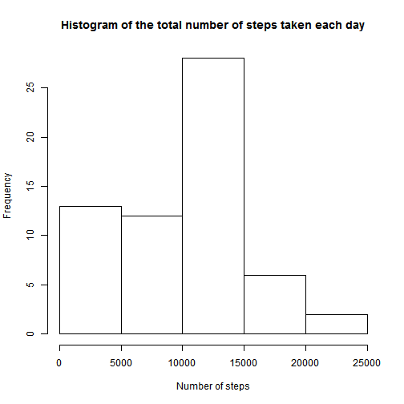
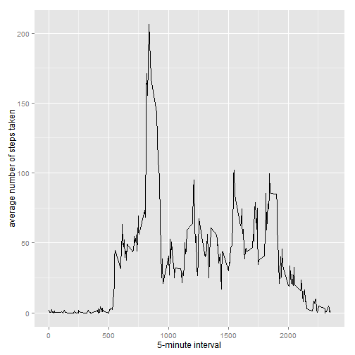
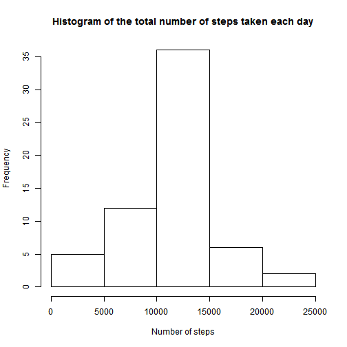
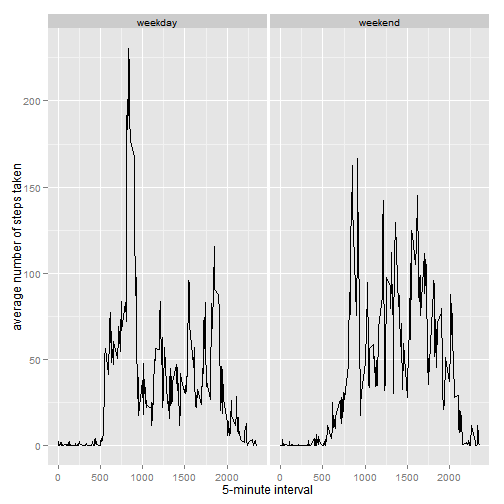

## loading packages

```r
library(doBy)
```

```
## Loading required package: survival
## Loading required package: splines
```

```r
library(ggplot2)
```

## Loading and preprocessing the data

```r
act <- read.csv("C:\\Users\\Rafael\\Documents\\Coursera\\activity.csv")
act$date <- as.Date(act$date, format = "%Y-%m-%d")
```

## What is mean total number of steps taken per day?

```r
steps <- summaryBy(steps~date, data = act, FUN = sum, na.rm=T)
hist(steps$steps, main = "Histogram of the total number of steps taken each day",
     xlab = "Number of steps")
```

 

2. mean and median of total steps all days

```r
tot.steps <- summaryBy(steps~date, data = act, FUN = sum, na.rm=T)
mean(tot.steps$steps.sum)
```

```
## [1] 9354.23
```

```r
median(tot.steps$steps.sum)
```

```
## [1] 10395
```

## What is the average daily activity pattern?

```r
average <- summaryBy(steps~interval, data = act, FUN = mean, na.rm = T)

ggplot(data=average, aes(x=interval, y=steps.mean)) +
  geom_line() +
  xlab("5-minute interval") +
  ylab("average number of steps taken")
```

 

```r
average[average$steps.mean == max(average$steps.mean), ]
```

```
##     interval steps.mean
## 104      835   206.1698
```

## Imputing missing values

```r
sum(is.na(act$steps))
```

```
## [1] 2304
```

```r
act2 <- act 
for(i in 1:nrow(act2)){
  if(is.na(act2$steps[i])){
    act2$steps[i] <- average[which(act2$interval[i] == average$interval), ]$steps.mean
  }
}

steps2 <- summaryBy(steps~date, data = act2, FUN = sum, na.rm=T)
hist(steps2$steps, main = "Histogram of the total number of steps taken each day",
     xlab = "Number of steps")
```

 

4. mean and median of total steps all days

```r
tot.steps2 <- summaryBy(steps~date, data = act2, FUN = sum, na.rm=T)
mean(tot.steps2$steps.sum)
```

```
## [1] 10766.19
```

```r
median(tot.steps2$steps.sum)
```

```
## [1] 10766.19
```

## Are there differences in activity patterns between weekdays and weekends?

```r
act2$wkdays <- weekdays(act2$date)
for(i in 1:nrow(act2)){
  if((act2$wkdays[i] == "segunda-feira") | (act2$wkdays[i] == "terça-feira") |
       (act2$wkdays[i] == "quarta-feira") | (act2$wkdays[i] == "quinta-feira") | 
       (act2$wkdays[i] == "sexta-feira")){
    act2$weekdays[i] <- "weekday"
  } else act2$weekdays[i] <- "weekend"
}

average2 <- summaryBy(steps~interval+weekdays, data = act2, FUN = mean, na.rm = T)

ggplot(data = average2, aes(x = interval, y = steps.mean)) +
  geom_line() +
  xlab("5-minute interval") +
  ylab("average number of steps taken") +
  facet_grid(. ~ weekdays)
```

 
